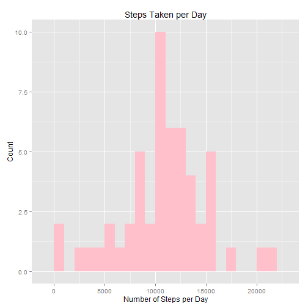
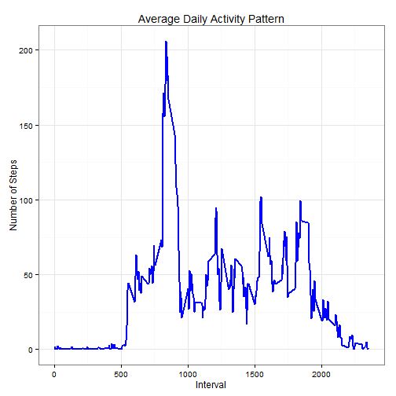
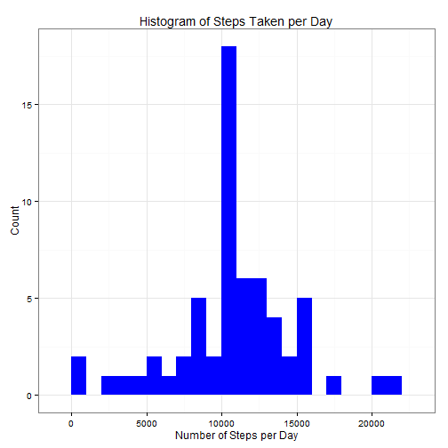
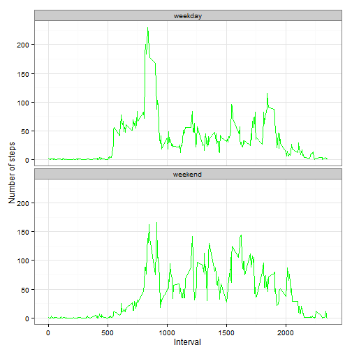

# Introduction
It is now possible to collect a large amount of data about personal movement using activity monitoring devices such as a Fitbit, Nike Fuelband, or Jawbone Up. These type of devices are part of the “quantified self” movement – a group of enthusiasts who take measurements about themselves regularly to improve their health, to find patterns in their behavior, or because they are tech geeks. But these data remain under-utilized both because the raw data are hard to obtain and there is a lack of statistical methods and software for processing and interpreting the data.

This assignment makes use of data from a personal activity monitoring device. This device collects data at 5 minute intervals through out the day. The data consists of two months of data from an anonymous individual collected during the months of October and November, 2012 and include the number of steps taken in 5 minute intervals each day.

The first part of this document loads the data, the middle section answers the assignment questions, and the document ends by summarizing the conclusions. In the middle section, there are two subsections, the first answers questions using the data as-is with missing values (NAs); the second, fills in the missing values and re-analyzes the data with the missing values filled in.

# Loading and Processing the Data

## Load Data and Appropriate Libraries

First unzip the data and read the .csv file. 


```r
unzip(zipfile = ("activity.zip"))
data <- read.csv("activity.csv")
```


Load the appropriate libraries and set echo = __TRUE__ and results = __hold__ for this document.

```r
library(knitr)
opts_chunk$set(echo = TRUE, results = 'hold')
library(ggplot2)
```

## Preprocess the Data


```r
data$date = as.Date(data$date, format = "%Y-%m-%d")
data$interval = as.factor(data$interval)
```

# Questions to Answer

## Ignore the Missing Values

Ignore missing values in the dataset and answer the following questions.

### What is the mean total number of steps taken per day?

1. Calculate the total number of steps taken per day.


```r
total_steps_per_day <- aggregate(steps ~ date, data, sum)
colnames(total_steps_per_day) <- c("date", "steps")
```

Print the first few lines of the calculation to see that it was done correctly.


```r
head(total_steps_per_day)
```

```
##         date steps
## 1 2012-10-02   126
## 2 2012-10-03 11352
## 3 2012-10-04 12116
## 4 2012-10-05 13294
## 5 2012-10-06 15420
## 6 2012-10-07 11015
```

2. Make a histogram of the total number of steps taken per day.

```r
ggplot(total_steps_per_day, aes(x = steps)) + 
       geom_histogram(fill = "pink", binwidth = 1000) + 
        labs(title="Steps Taken per Day", 
             x = "Number of Steps per Day", y = "Count")
```

 

3. Calculate and report the mean and median of the total number of steps taken per day. 

```r
mean_steps = mean(total_steps_per_day$steps, na.rm = TRUE)
median_steps = median(total_steps_per_day$steps, na.rm = TRUE)
```

The mean number of steps per day is ___10766.19___ and the median number of steps per day is ___10765___.

### What is the average daily activity pattern?

1. Make a time-series plot of 5-minute intervals (x-axis) vs. the average number of steps taken in that interval across all days (y-axis).


```r
average_steps_per_interval <- aggregate(data$steps, by = list(interval = data$interval),
                                FUN=mean, na.rm=TRUE)
#convert to integers (helps with plotting)
average_steps_per_interval$interval <- 
        as.integer(levels(average_steps_per_interval$interval)[average_steps_per_interval$interval])
colnames(average_steps_per_interval) <- c("interval", "steps")
```

Print out the first few rows so ensure that the average was computed.


```r
head(average_steps_per_interval)
```

```
##   interval     steps
## 1        0 1.7169811
## 2        5 0.3396226
## 3       10 0.1320755
## 4       15 0.1509434
## 5       20 0.0754717
## 6       25 2.0943396
```

2. Which 5-minute interval, when averaged across all days, has the highest mean number of steps?


```r
ggplot(average_steps_per_interval, aes(x=interval, y=steps)) +   
        geom_line(color="blue", size=1) +  
        labs(title="Average Daily Activity Pattern", x="Interval", y="Number of Steps") + theme_bw()
```

 

Use the summary function to print a summary of the average steps per interval.

```r
summary(average_steps_per_interval)
```

```
##     interval          steps        
##  Min.   :   0.0   Min.   :  0.000  
##  1st Qu.: 588.8   1st Qu.:  2.486  
##  Median :1177.5   Median : 34.113  
##  Mean   :1177.5   Mean   : 37.383  
##  3rd Qu.:1766.2   3rd Qu.: 52.835  
##  Max.   :2355.0   Max.   :206.170
```

The exact interval containing the maximum number of steps can be found via:

```r
average_steps_per_interval[which.max(average_steps_per_interval$steps),]
```

```
##     interval    steps
## 104      835 206.1698
```

From the above output, it can be seen that the maximum average number of steps per interval occurs at interval ___835___ and the maximum number of steps is ___206.2___.

## Filling in Missing Values

1. Calculate the total number of missing values in the dataset, i.e., the total number of rows that have NAs. 


```r
num_NAs <- sum(is.na(data$steps))
```

Using the table() function summarizes the output, showing the total number of missing values in the dataset is ___2304___. 


```r
table(num_NAs)
```

```
## num_NAs
## 2304 
##    1
```

2. Devise a strategy for filling in missing values.

There are a large number of NAs in the dataset and filling them in can affect the overal data analysis. The method adopted in this report for filling in missing values is to replace the NAs with the mean value for that interval.
    
    
    ```r
    na_fill <- function(data, val) {
        na_idx <- which(is.na(data$steps))
        na_rep <- unlist(lapply(na_idx, FUN=function(idx){
                interval = data[idx,]$interval
                val[val$interval == interval,]$steps
        }))
        fill_steps <- data$steps
        fill_steps[na_idx] <- na_rep
        fill_steps
    }
    
    dataf <- data.frame(  
        steps = na_fill(data, average_steps_per_interval),  
        date = data$date,  
        interval = data$interval)
    str(dataf)
    ```
    
    ```
    ## 'data.frame':	17568 obs. of  3 variables:
    ##  $ steps   : num  1.717 0.3396 0.1321 0.1509 0.0755 ...
    ##  $ date    : Date, format: "2012-10-01" "2012-10-01" ...
    ##  $ interval: Factor w/ 288 levels "0","5","10","15",..: 1 2 3 4 5 6 7 8 9 10 ...
    ```
    
Check that there are no remaining missing values.


```r
sum(is.na(dataf$steps))
```

```
## [1] 0
```

The output equal to zero shows there are no missing values.

3. Create a new dataset that is equivalent to the old dataset but with missing values filled in. 

The dataset dataf, created in the above code, has the missing values filled in. 
4. Make a histogram of the total number of steps taken for that day. 


```r
fill_steps_per_day <- aggregate(steps ~ date, dataf, sum)
colnames(fill_steps_per_day) <- c("date","steps")

##plotting the histogram
ggplot(fill_steps_per_day, aes(x = steps)) + 
       geom_histogram(fill = "blue", binwidth = 1000) + 
        labs(title="Histogram of Steps Taken per Day", 
             x = "Number of Steps per Day", y = "Count") + theme_bw()
```

 

    a. Compute the mean and median total number of steps taken for the day.

```r
total_steps_per_day_filled <- aggregate(steps ~ date, dataf, sum)
colnames(total_steps_per_day_filled) <- c("date", "steps")
mean_steps_filled = mean(total_steps_per_day_filled$steps, na.rm = TRUE)
median_steps_filled = median(total_steps_per_day_filled$steps, na.rm = TRUE)
```

The mean steps are ___10766.19___ and the median steps are ___10766.19___.  The mean did not change from the earlier calculation, but the median increased slightly.
       
    b. Do these values differ from the estimates computed in the first part of the assignment?
Yes, these values do differ slightly. The mean before filling in the missing values is ___10766.19___ and the median is ___10765___. After filling in the missing values with the average of the 5 minute interval, the mean is ___10766.19___ and the median is ___10766.19___.
       
    c. What is the effect of filling in missing data on the estimates of the total daily number of steps?
The mean and median are equal after filling in the NAs with the average of the 5 minute interval. Between filling in the NAs and not, the means did not change, but the median increased slightly.

## Examining Activity Patterns Between Weekdays and Weekends

The goal of this section is to answer the question, "Are there differences in activity patterns between weekdays and weekends?" The dataset with the missing values filled in will be used to complete this section.

1. Make a new factor variable in the dataset with two levels - "weekday" and "weekend" - indicating whether a given day is a weekday or a weekend day.

```r
weekdays_steps <- function(data) {
    weekdays_steps <- aggregate(data$steps, by=list(interval = data$interval),
                          FUN=mean, na.rm=T)
    # convert to integers for plotting
    weekdays_steps$interval <- 
            as.integer(levels(weekdays_steps$interval)[weekdays_steps$interval])
    colnames(weekdays_steps) <- c("interval", "steps")
    weekdays_steps
}

data_by_weekdays <- function(data) {
    data$weekday <- 
            as.factor(weekdays(data$date)) # weekdays
    weekend_data <- subset(data, weekday %in% c("Saturday","Sunday"))
    weekday_data <- subset(data, !weekday %in% c("Saturday","Sunday"))

    weekend_steps <- weekdays_steps(weekend_data)
    weekday_steps <- weekdays_steps(weekday_data)

    weekend_steps$dayofweek <- rep("weekend", nrow(weekend_steps))
    weekday_steps$dayofweek <- rep("weekday", nrow(weekday_steps))

    data_by_weekdays <- rbind(weekend_steps, weekday_steps)
    data_by_weekdays$dayofweek <- as.factor(data_by_weekdays$dayofweek)
    data_by_weekdays
}

data_weekdays <- data_by_weekdays(dataf)
```

2. Make a panel plot containing a time series plot of the 5-minute interval (x-axis) and the average number of steps taken, averaged across all weekday days or weekend days (y-axis).


```r
ggplot(data_weekdays, aes(x=interval, y=steps)) + 
        geom_line(color="green") + 
        facet_wrap(~ dayofweek, nrow=2, ncol=1) +
        labs(x="Interval", y="Number of steps") +
        theme_bw()
```

 

The panel plot shows that weekends have more intervals where number of steps is larger on average (e.g., greater than 100), but weekdays have a higher peak value.
